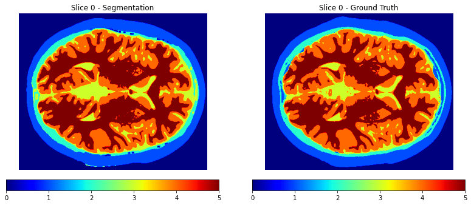

# 🧠 Brain MRI Segmentation using Classical Computer Vision

This project implements a multi-class segmentation pipeline for axial brain MRI slices using **traditional computer vision techniques**. Without using any deep learning, it segments six key anatomical brain regions based on intensity thresholds and morphological processing.

---

## 📌 Project Summary

- **Dataset**: 10 axial T1-weighted MRI slices from `Brain.mat`
- **Labels Segmented**:
  - `0`: Air  
  - `1`: Skin/Scalp  
  - `2`: Skull  
  - `3`: CSF (Cerebrospinal Fluid)  
  - `4`: Gray Matter  
  - `5`: White Matter  
- **Techniques**:
  - Image normalization
  - Gaussian filtering
  - Morphological operations
  - Region-based binary classification
  - Label post-processing
- **Evaluation Metrics**:
  - Jaccard Index (IoU)
  - F1 Score

---

## 🧪 Methodology Breakdown

### 1. Preprocessing
- **Intensity Normalization**: Rescales image intensities to 0–255 (8-bit).
- **Gaussian Filter**: Reduces noise using a low-pass filter.
- **Otsu Thresholding**: Automatically computes a global threshold value to binarize the image.
- **Morphological Cleaning**:
  - Remove small objects (<5000 px)
  - Remove large regions (>50000 px)
  - Dilate mask to capture outer boundaries

### 2. Segmentation Stages
Each slice undergoes the following sequence:

| Stage | Region             | Operation |
|-------|--------------------|-----------|
| 1     | Air                | Binary threshold at 0 |
| 2     | Skin/Scalp         | Binary range 1–10 |
| 3     | Skull              | Binary range 19–40 with morphological closing |
| 4     | CSF                | Binary range 36–89, postprocessed |
| 5     | Gray Matter        | Binary range 81–130 |
| 6     | White Matter       | Binary range 121–255 |

### 3. Post-processing
- Region values are re-mapped for clarity:
0 → Air 1 → Skin/Scalp 2 → Skull 3 → CSF 4 → Gray Matter 5 → White Matter

- Any undefined region is reassigned to `Skin/Scalp` (label `1`) to preserve anatomical structure.
- Hole filling is applied on the air region mask to prevent gaps.

---

## 📊 Per-Slice Segmentation Results

| Slice | Jaccard Index | F1 Score |
|-------|---------------|----------|
| 0     | 0.8771        | 0.9325   |
| 1     | 0.8769        | 0.9326   |
| 2     | 0.8677        | 0.9272   |
| 3     | 0.8509        | 0.9175   |
| 4     | 0.8480        | 0.9157   |
| 5     | 0.8523        | 0.9182   |
| 6     | 0.8389        | 0.9100   |
| 7     | 0.8385        | 0.9098   |
| 8     | 0.8375        | 0.9091   |
| 9     | 0.8482        | 0.9155   |

**📌 Average Jaccard Index**: `0.8536`  
**📌 Average F1 Score**: `0.9188`

---

## 🖼️ Example Output


Below is a comparison between the **segmented output** and the **ground truth** for a selected slice.



---

## 📄 File Structure
```
Brain-MRI-Segmentation/
├── Data/
│   └── Brain.mat               # Dataset
├── Results/
│   └── slice_comparison.png    # Results Images (segmented vs ground truth)
├── .gitattributes              # Git ignore file
├── LICENSE                     # License Project
├── README.md                   # Project documentation
├── Brain-MRI-Segmentation.py   # Main Python scrip
└── Requirements.txt            # List of dependencies

```

---

## 🚀 How to Run

### 1. Clone the repository

```bash
git clone https://github.com/yourusername/brain-mri-segmentation.git
cd brain-mri-segmentation

